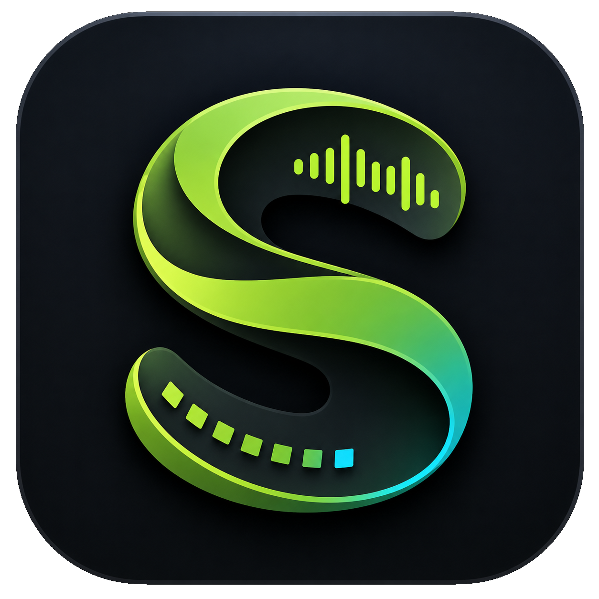

# Strudel Studio

<p align="center">
  
</p>

**Strudel Studio is a local-first desktop studio for Strudel live coding.**

It keeps the immediacy of Strudel while adding the workflow pieces you expect from a desktop music tool: real project folders, real `.strudel` files, saved workspaces, multi-file playback, local samples, editor tabs, live updates, per-file volume controls, and sidebar sliders for `slider(...)` values.

Strudel Studio is built for performers and pattern writers who want to keep their Strudel sketches organized without giving up fast feedback.

## Features

- **Local-first projects**: choose a project folder and work with normal files on disk.
- **Real `.strudel` files**: create, open, edit, and save Strudel files directly.
- **Workspace restore**: save open files, Play All selection, file volumes, and workspace state.
- **Recent projects**: quickly return to previous Strudel Studio projects.
- **Tabbed editor**: keep multiple patterns open at once.
- **Middle-click tab close**: close editor tabs with the same gesture used by many code editors.
- **Split editor panels**: split the editor vertically or horizontally and close panels as needed.
- **Syntax highlighting**: Strudel code is edited with a CodeMirror-based JavaScript editor.
- **Single-file playback**: play the active file.
- **Play All**: check multiple files and perform them together.
- **Live re-evaluation**: edit while playback is running and hear changes update automatically.
- **Per-file volume**: adjust each checked file from the project sidebar.
- **Sidebar sliders**: inspect `slider(...)` calls in the active file and edit value, min, max, and step without leaving the sidebar.
- **Local sample serving**: project sample metadata is served to the Strudel runtime when available.
- **Stop and panic controls**: stop playback normally or reset more aggressively during performance.
- **Error mapping**: Strudel evaluation errors are shown with file and line information when possible.
- **Desktop packaging**: Windows installer/portable builds, plus macOS and Linux targets.

## Install

The easiest way to use Strudel Studio is to download a packaged build from the project releases when available.

### Windows

Use one of these release artifacts:

- `Strudel Studio-Setup-0.8.0-win-x64.exe` for a normal installer.
- `Strudel Studio-Portable-0.8.0-win-x64.exe` for a portable app.

After building locally, the quickest test executable is:

```text
build\win-unpacked\Strudel Studio.exe
```

### macOS

Use the `.dmg` or `.zip` artifact when available. Current local builds are unsigned, so macOS may require explicit approval in System Settings.

### Linux

Use the `.AppImage` or `.deb` artifact when available.

## Quick Start

1. Open Strudel Studio.
2. Click **New Project** and choose a folder.
3. Create `drums.strudel`.
4. Write a pattern:

   ```js
   $: s("bd*4")
   ```

5. Press **Play**.
6. Create `bass.strudel`.
7. Write another pattern:

   ```js
   $: note("c2 eb2 g2").s("sawtooth")
   ```

8. Check both files in the left sidebar.
9. Press **Play All**.
10. Move file volume sliders or open the **Sliders** sidebar tab for `slider(...)` controls.
11. Save files and save the workspace.

## Using Sidebar Sliders

Any numeric Strudel `slider(...)` call in the active file appears in the right sidebar under **Sliders**.

Example:

```js
$: note("c2 eb2 g2")
  .s("sawtooth")
  .attack(slider(0.03, 0, 0.2, 0.01))
  .legato(slider(1.2, 0, 5, 0.1))
```

The sidebar lets you:

- move the current slider value;
- edit `min`, `max`, and `step` on hover;
- update the source code automatically;
- hear changes while playback is running.

## Local Samples

Strudel Studio is designed around project folders. When a project has local sample metadata available, the app serves that metadata to the Strudel runtime so patterns can reference local sample names.

Sample support is still an MVP feature. Keep sample folders inside the project so the workspace remains portable.

## Build From Source

Install [Node.js LTS](https://nodejs.org/), then clone the repository and install dependencies:

```sh
npm install
```

Run the development app:

```sh
npm run dev
```

Build the renderer/main process only:

```sh
npm run build
```

Create an unpacked desktop build:

```sh
npm run package:dir
```

## One-Click Build Scripts

Build output goes to the `build/` folder. The scripts clean old build output first so stale installers do not sit beside fresh ones.

### Windows

Double-click:

```text
build-all.bat
```

This builds the Windows installer and portable `.exe`, then tries Linux packaging if the host machine supports it.

### macOS and Linux

Run:

```sh
sh build-all.sh
```

The practical release flow is:

- Build Windows packages on Windows.
- Build macOS packages on macOS.
- Build Linux packages on Linux.

Cross-building every operating system from one machine is not fully reliable. macOS packages should be built on macOS because Apple packaging, signing, and notarization are platform-specific.

## Packaging Targets

- Windows: NSIS installer and portable `.exe`.
- macOS: `.dmg` and `.zip`.
- Linux: `.AppImage` and `.deb`.

Current packages are unsigned. Code signing, notarization, release automation, and auto-update are good next steps for public distribution.

## Project Status

Strudel Studio is currently an MVP desktop app. The core workflow is usable:

- create a project;
- create and edit Strudel files;
- play one file;
- play multiple selected files together;
- update playback while editing;
- save files and workspaces;
- reopen projects and restore workspace state.

Planned improvements include visual Strudel widgets, stronger sample management, richer Strudel autocomplete/snippets, persistent settings, and a smoother release pipeline.

## License And Commercial Use

Strudel Studio is licensed under **AGPL-3.0-or-later**.

In practical terms:

- You may distribute builds for free or for money.
- You may charge for official builds, convenience, support, documentation, services, or warranty.
- Recipients keep their AGPL rights to inspect, modify, build, and redistribute the software.
- If you distribute binaries, you must provide the corresponding source code under the AGPL.
- If you run a modified network-accessible version, users must be offered the corresponding source code.

That means a paid official build is allowed, but it is not proprietary software. A good commercial model is to charge for convenience and trust: signed installers, tested releases, support, docs, sample packs you have rights to distribute, and ongoing development.

Donation, pay-what-you-want, paid official binaries, sponsorship, and support plans are all compatible with the spirit of this project. For legal decisions, read the AGPL text and consult a lawyer if money or customer contracts are involved.

## Source

The source code and license are included in this repository.

- License: [GNU Affero General Public License v3](LICENSE)
- Strudel: [strudel.cc](https://strudel.cc/)
