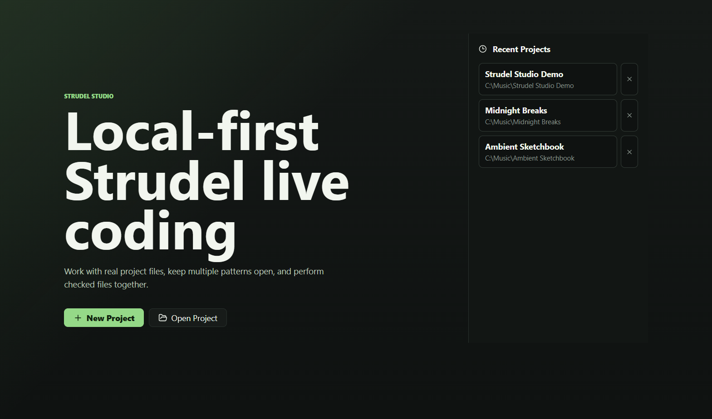
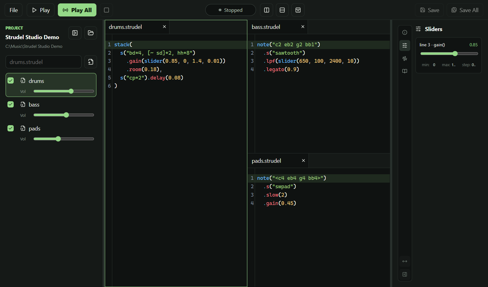
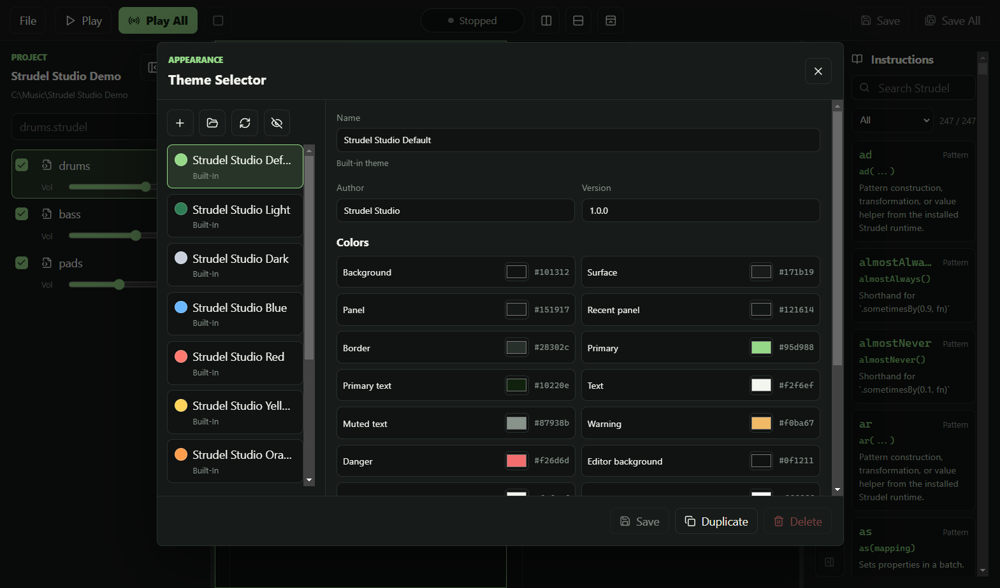
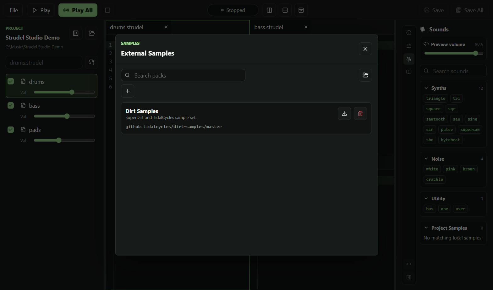

# Strudel Studio

<p align="center">
  
</p>

**Strudel Studio is a local-first desktop studio for Strudel live coding.**

It keeps Strudel fast and improvisational, while adding the desktop workflow pieces needed for a larger set: project folders, real `.strudel` files, saved workspaces, split editor panes, multi-file playback, local samples, external sample packs, runtime plugins, themes, and app options.

## Screenshots









## Features

- **Local-first projects**: create or open normal folders on disk.
- **Real `.strudel` files**: create, edit, save, and reopen project files directly.
- **Automatic sample folder**: new projects get an empty `samples/` folder.
- **Workspace restore**: restores open tabs, split layout, active file, Play All selection, per-file volume, and hidden-but-enabled files.
- **Recent projects**: reopen recent work from the start screen.
- **Tabbed and split editor**: open multiple files, split panes vertically or horizontally, and close panes independently.
- **Play active file**: perform the currently selected file.
- **Play All**: check multiple files in the left sidebar and play them together.
- **Per-file volume**: each tracked file has its own Play All volume slider.
- **Live re-evaluation**: playing files re-evaluate while you edit, unless disabled in Options.
- **Immediate stop**: the Stop button hushes playback and resets global effects.
- **Playback highlighting**: fired Strudel mini-notation source locations are outlined in the editor.
- **Syntax error indicators**: tabs and file rows show an error marker with the hoverable reason.
- **Right sidebar views**: playback info, sliders, sounds, and docs.
- **Slider editor**: detected `slider(...)` calls can be edited from the sidebar, including value, min, max, and step.
- **Sound browser**: browse and preview supported sounds, including loaded external sample names.
- **Docs browser**: searchable Strudel instruction lookup generated from the installed Strudel runtime sources.
- **External samples**: add, load, unload, remove, cache, and browse external `strudel.json` sample packs.
- **Local sample serving**: project sample metadata is served to Strudel from the project `samples/` folder when available.
- **Plugin support**: folder/source-based scripts can be added, loaded, unloaded, and removed.
- **Theme selector**: built-in themes, custom themes, duplicate/delete, font search, font sizes, and editable colors including recent panel and playback highlight colors.
- **Options panel**: File -> Options controls file-selection behavior and live re-evaluation.
- **Packaged desktop builds**: Windows, macOS, and Linux packaging through Electron Builder.

## Running A Release Build

Download the correct artifact for your operating system from a release, or use files produced in `build/bin` after a local package build.

### Windows

Use one of:

- `Strudel Studio-Setup-1.0.0-win-x64.exe` for the installer.
- `Strudel Studio-Portable-1.0.0-win-x64.exe` for the portable app.

### macOS

Use the `.dmg` artifact, or the `.zip` if you prefer extracting the app manually.

Current local builds are unsigned. macOS may require explicit approval in System Settings before first launch.

### Linux

Use one of:

- `Strudel Studio-1.0.0-linux-x64.AppImage`
- `Strudel Studio-1.0.0-linux-x64.deb`

For AppImage:

```sh
chmod +x "Strudel Studio-1.0.0-linux-x64.AppImage"
./"Strudel Studio-1.0.0-linux-x64.AppImage"
```

For Debian/Ubuntu:

```sh
sudo apt install ./Strudel\ Studio-1.0.0-linux-x64.deb
```

## Running From Source

Install Node.js LTS, clone the repository, then install dependencies:

```sh
npm install
```

Run the development app:

```sh
npm run dev
```

Build the Electron main/preload/renderer output:

```sh
npm run build
```

Preview the built app:

```sh
npm run preview
```

## Build Commands

The package commands write Electron Builder output to `build/`. Final distributable artifacts are copied into `build/bin`; intermediate folders such as unpacked apps and blockmaps can remain in `build/`.

```sh
npm run package:dir    # unpacked app for local inspection
npm run package:win    # Windows installer and portable exe
npm run package:mac    # macOS dmg and zip
npm run package:linux  # Linux AppImage and deb
npm run package:all    # attempts all configured targets
```

The lower-level build command is:

```sh
npm run build:app
```

It runs TypeScript checking and `electron-vite build`, but does not package installers.

## Build Scripts

Use the scripts if you want the simple release flow.

### Windows

```bat
build-all.bat
```

The batch script:

- removes the old `build/` folder;
- runs `npm install`;
- builds the app;
- creates Windows installer and portable artifacts;
- copies final artifacts into `build/bin`;
- tries Linux packaging if the host supports it.

### macOS / Linux

```sh
sh build-all.sh
```

On macOS it builds macOS packages first, then tries Windows/Linux where possible. On Linux it builds Linux packages first, then tries Windows where possible.

macOS packages should be built on macOS. Windows packages are most reliable on Windows. Linux packages are most reliable on Linux or a Linux CI runner.

## Project Workflow

1. Start Strudel Studio.
2. Create or open a project folder.
3. Create `.strudel` files from the left sidebar.
4. Press **Play** to run the active file.
5. Check files in the left sidebar and press **Play All** to run them together.
6. Adjust file volumes from the left sidebar.
7. Use the right sidebar for playback info, sliders, sounds, and docs.
8. Save files with **Save** / **Save All**. Workspace state autosaves.

By default, checking a file for Play All does not open it in the editor, and closing the last tab of an enabled file does not disable it. Change this in **File -> Options**.

## Samples

Every new project gets a `samples/` folder. Keep local sample files and sample metadata there so the project remains portable.

External sample packs can be managed from **File -> External Samples**. The panel supports:

- adding a URL or GitHub source;
- loading and unloading packs;
- removing pack entries;
- caching referenced audio files;
- opening the external samples folder;
- previewing loaded sounds from the Sounds sidebar tab.

## Plugins

Plugins are folder/source-based scripts that are evaluated into the Strudel runtime. Manage them from **File -> Plugins**.

The plugin panel supports:

- adding a source URL/GitHub repo;
- importing a local plugin folder;
- loading and unloading scripts;
- removing plugin entries;
- opening the plugins folder.

Treat plugins as code. Only load scripts from sources you trust.

## Themes

Open **File -> Theme Selector** to use built-in themes or create your own.

Themes support:

- built-in light/dark/color variants;
- duplicate, save, and delete for custom themes;
- author and version metadata;
- interface and editor fonts;
- interface and editor font sizes;
- font search;
- editable UI/editor colors;
- recent project panel color;
- playback highlight color.

Built-in themes cannot be saved over or deleted. Duplicate one first if you want to customize it.

## Options

Open **File -> Options**.

Current options:

- **Keep enabled files after closing tabs**: closing the last visible tab hides the file but keeps it included in Play All.
- **Open files when enabling Play All**: checking a file also opens it in the active editor panel.
- **Live re-evaluate while playing**: edits to playing files are sent to Strudel automatically.

Options are saved locally on the machine.

## Screenshots For Docs

Screenshots in `docs/screenshots` are generated with a deterministic mock project:

```sh
npm run screenshots
```

The script builds the app, launches the renderer in Electron, captures the PNGs, and exits.

## Notes

- Packaged builds are currently unsigned.
- Auto-update is not implemented.
- External sample and plugin loading can execute or fetch third-party content; use trusted sources.
- This app embeds Strudel runtime packages through npm dependencies.

## License

Strudel Studio is licensed under **AGPL-3.0-or-later**.

You may distribute builds for free or for money, but recipients keep their AGPL rights to inspect, modify, build, and redistribute the software. If you distribute binaries, provide the corresponding source code under the AGPL. If you run a modified network-accessible version, users must be offered the corresponding source code.

See [LICENSE](LICENSE) for the full license text.

## Links

- Strudel: [strudel.cc](https://strudel.cc/)
- License: [GNU Affero General Public License v3](LICENSE)
